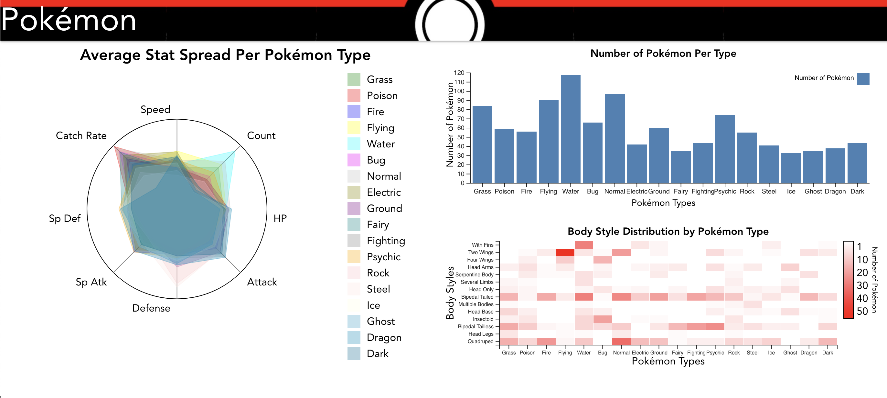

# Pokémon Types and Body Styles

## Description of Visualization Goals

Nuzlocke challenges are a type of challenge to make Pokémon games more difficult.
The rules are as follows:

1. If a Pokémon faints, it is considered dead and must be released or permanently boxed.
2. You can only catch the first Pokémon you encounter in each area.
3. You must nickname all of your Pokémon.

The goal of this visualization is to show the distribution of Pokémon types and body styles to assist in choosing the viability of a combination of type and body style for a Nuzlocke challenge, since these runs are often mono-type and mono-body style.

## Sketch of Visualization

The focus view is the average stat values of Pokémon of a given type.
This is because the stats of a Pokémon type are the most important factor in determining its usefulness in a Nuzlocke challenge.

One of the context views is the distribution of Pokémon types and body styles, since the body style information is not available in the main view, and is also important in determining the viability of a Pokémon type in a Nuzlocke challenge.

The other context view is the number of Pokemon of a given type, since the number of Pokémon of a given type available also determines the viability of a Pokémon type in a Nuzlocke challenge.

